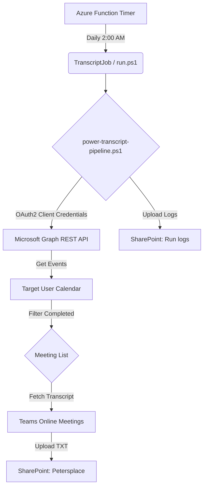

# Microsoft Teams Transcript Pipeline

An automated PowerShell-based pipeline that fetches Microsoft Teams meeting transcripts via Microsoft Graph and uploads them to SharePoint. This project is specifically designed to run as an **Azure Function** (PowerShell 7.4) using a daily timer trigger.

## 🏗 Architecture



## 🚀 Key Features

- **SDK-Free Graph Integration**: Uses standard REST API calls (`Invoke-RestMethod`) to avoid common "Assembly already loaded" SDK conflicts in Azure Functions.
- **Azure Function Native**: Includes a pre-configured `TranscriptJob` with a daily timer trigger (Default: 2:00 AM).
- **7-Day Retry Window**: Automated runs look back 7 days by default. This ensures that any transcripts that failed or were delayed in previous runs are retried, while built-in deduplication (SKIP logic) prevents duplicate processing.
- **SharePoint Integration**: Automatically organizes transcripts into month-based folders (`YYYY-MM`) and maintains execution logs.
- **Resilient Execution**: Configured with a 10-minute timeout to handle large batches of meetings.

## 🔑 Permissions (Microsoft Graph)

The Azure AD App Registration (Service Principal) used for this pipeline requires the following **Application Permissions**:

| Scope | Purpose |
| :--- | :--- |
| `Calendars.Read` | To scan the target user's calendar for Team meetings. |
| `OnlineMeetingTranscript.Read.All` | To download the meeting transcripts. |
| `Sites.ReadWrite.All` | To create folders and upload transcript files to SharePoint. |
| `User.Read.All` | To resolve organizer IDs and UPNs. |

> **Note**: These must be "Application" permissions, and "Admin Consent" must be granted in the Azure Portal.

## ⚙️ Configuration (Azure App Settings)

| Setting | Description |
| :--- | :--- |
| `GRAPH_CLIENT_SECRET` | The client secret from your Azure AD App Registration. |
| `WEBSITE_TIME_ZONE` | Set to `GMT Standard Time` for accurate CRON scheduling. |
| `AzureWebJobsStorage` | Connection string for the internal storage account. |

## 🔄 Backfilling Historical Data

The pipeline supports manual backfilling by passing custom date ranges. Since the Azure Function is a wrapper for the pipeline script, you can run it manually via the terminal:

1. **Navigate to the root directory.**
2. **Run the script with parameters**:
   ```powershell
   .\power-transcript-pipeline.ps1 -FromDate "2026-05-01" -ToDate "2026-05-31"
   ```
   *Note: Ensure your `GRAPH_CLIENT_SECRET` is set in your local session environment before running.*

## 🛠 Troubleshooting

### 1. "Assembly with same name is already loaded"
This is a known issue when using the Microsoft Graph SDK in Azure Functions. This project resolves this by using standard REST calls instead of the SDK DLLs. **Do not re-add the Graph SDK to `requirements.psd1`**.

### 2. SharePoint "Access Denied" (403)
Ensure the App Registration has `Sites.ReadWrite.All` and that the SharePoint Site URL in `power-transcript-pipeline.ps1` (`$spSiteServerRelPath`) is correct.

## 🚢 Deployment

```bash
az login
func azure functionapp publish peter-consolidate-meeting-transcripts --powershell
```

---
*Generated by Rovo Dev*


---
*Copyright © 2026 Virrata AB. All rights reserved. Proprietary and confidential.*
