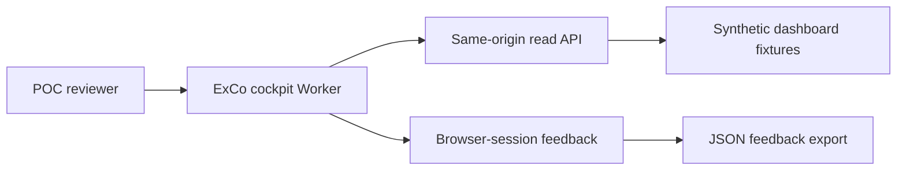

# CEO/ExCo Cockpit — Coding-Agent Handoff

> **Status and precedence notice — 2026-08-11:** This is the original implementation handoff, retained for historical implementation detail. The accepted two-view synthetic cockpit baseline and its continuation gates are defined in [`plans/exco-cockpit-session-state-2026-08-11.md`](exco-cockpit-session-state-2026-08-11.md). For repository-wide current status and restart instructions, read [`plans/STATUS.md`](STATUS.md) first. Where this handoff differs from either current status document, this handoff is superseded.

## 1. Purpose

Build the smallest Cloudflare-hosted CEO/ExCo cockpit that lets reviewers assess the quality of the existing Cloudflare meeting-processing output. This is a synthetic-data, evidence-first POC. It is not a production governance system and must not change the Azure-to-SharePoint production pipeline.

The cockpit validates whether current extracted topics, decisions, actions, risks, evidence assertions, validation warnings, and topic-memory trajectory are useful and correctly represented for executive review.

## 2. Architectural Boundary

Create a new independent Worker package at:

```text
packages/exco-cockpit/
```

The package owns a static single-page web UI and a same-origin `/api/v1` API. It must not import or modify the ingestion Worker implementation in `packages/cloudflare-runtime/`.



### Non-negotiable isolation rules

- Do not modify `packages/pipeline/` or Azure Function behaviour.
- Do not modify `packages/cloudflare-runtime/`, its taxonomy, prompt, D1 schema, topic matching, queues, or runtime endpoints.
- Do not read production D1, R2, Azure, SharePoint, Teams, or any real-meeting dataset.
- Do not display raw transcript text in the UI or return it from any API response.
- Do not mutate topics, actions, decisions, meetings, or topic-memory records.
- Do not add a D1 database, D1 migration, persistent feedback API, or identity integration in this release.
- Use only synthetic records created within the new dashboard package.

## 3. Package Contents

Use a minimal TypeScript Cloudflare Worker layout that is consistent with the existing Worker packages:

```text
packages/exco-cockpit/
  package.json
  package-lock.json
  tsconfig.json
  vitest.config.ts
  wrangler.jsonc
  src/
    index.ts
    fixtures.ts
    types.ts
    api.ts
    index.test.ts
  public/
    index.html
    app.js
    styles.css
```

Equivalent organization is acceptable if it preserves the following boundaries:

- Worker routing and JSON response construction are server-side.
- Synthetic fixture data is a dedicated module, not embedded across UI components.
- API response types are explicit and shared by handler/tests where practical.
- UI assets are static assets served by the same Worker deployment.
- The browser UI owns feedback state; the Worker never receives feedback submissions.

Use the current stable Wrangler static-assets configuration supported by the local project toolchain. The current project lockfile confirms Wrangler 4.118.0 is available; configure the new Worker with `assets: { directory: "./public" }`. Do not invent a Pages deployment or introduce a frontend framework unless the coding agent documents why the minimal static UI cannot meet the acceptance criteria.

Use an accessible tab/panel navigation pattern within the single HTML page rather than hash-based routing. Each tab must have an explicit active state, keyboard-accessible control, and a predictable panel for Overview, Decisions, Risks and Actions, and Topic Trajectory. A dedicated evidence modal, drawer, or panel is acceptable for drill-down.

## 4. Data Model and Synthetic Fixture Requirements

Create dashboard-specific synthetic data. Do not reuse the runtime-shadow baseline as the dashboard source because its current normalized output is intentionally minimal.

All IDs must be clearly synthetic, stable, and fixture-scoped, for example `fx-meeting-001`, `fx-topic-001`, `fx-decision-001`, and `fx-memory-001`.

Fixture data must include all of the following:

1. At least two source meetings, with synthetic subject, organizer, and event date.
2. At least one cross-functional topic where `outcome` is `Risk`.
3. At least one first-class decision with linked topic, owner, source meeting, and evidence context.
4. At least one open action with linked topic, owner, source meeting, and optional due date.
5. At least one topic-memory item spanning two meetings, with first/last seen dates and a meeting count greater than one.
6. At least one topic-memory item in `pending_review` match state.
7. At least one topic with a validation warning and a visible validation reason.
8. Evidence assertions across key facts, decisions, actions, and risks.
9. Explicit fixture examples that are intentionally weak or incomplete so reviewers can record each verdict type:
   - accurate;
   - incomplete;
   - incorrect;
   - irrelevant.
10. At least one absent governance attribute, such as accountable executive, materiality, dependency, intervention request, or review date, represented by a UI-ready `Not extracted` data-gap state rather than inferred content.

Fixtures must not contain realistic personal, commercial, customer, project, transcript, or meeting data.

## 5. API Contract

All API responses must be JSON, same-origin, and versioned under `/api/v1`. Use a stable response envelope:

```ts
interface ApiEnvelope<T> {
  apiVersion: 'v1';
  data: T;
}
```

Return JSON `404` responses for unsupported item types or unknown IDs. Return JSON `405` responses for unsupported HTTP methods. API endpoints are read-only and must reject non-GET methods.

### 5.1 `GET /api/v1/overview`

Returns summary counts and the small set of high-signal cards used by the landing view.

Required data:

- total fixture meetings;
- risk-topic count;
- decision count;
- open-action count;
- validation-warning count;
- topic-memory count;
- pending-match-review count;
- compact lists for recent risks, decisions, actions, warnings, and data gaps.

### 5.2 `GET /api/v1/decisions`

Returns a decision register. Every decision must include:

- decision ID and text;
- owner, or `Not extracted` when absent;
- linked topic ID and topic statement;
- source meeting ID, subject, and date;
- evidence assertion identifiers or a concise evidence preview;
- a deterministic evidence-detail URL.

### 5.3 `GET /api/v1/risks-actions`

Returns separate `risks` and `actions` collections.

Risk items must be based only on current evidence-first records such as risk-outcome topics and extracted risk assertions. The API/UI must expose a label explaining that this is an evidence proxy, not a complete governed risk register.

Action items must include text, owner, status, due date if extracted, linked topic, source meeting, and evidence-detail URL.

### 5.4 `GET /api/v1/topic-memory`

Returns topic-memory trajectory items with:

- memory ID;
- canonical statement;
- domain, entity type, entity, aspect;
- first and last seen date;
- meeting count;
- latest outcome, disposition, and executive scope;
- status;
- match status;
- pending-match reason if present;
- deterministic evidence-detail URL.

### 5.5 `GET /api/v1/evidence/:itemType/:itemId`

Supports only explicit fixture item types selected by the agent, at minimum `topic`, `decision`, `action`, and `topic-memory`.

Every evidence response must contain:

- item type and ID;
- item summary fields;
- linked source-meeting metadata;
- extracted evidence assertions;
- validation state and reasons if applicable;
- topic-memory linkage/trajectory where applicable;
- data gaps represented as `Not extracted`.

The evidence response and UI must never contain a raw transcript, transcript excerpt, R2 key, transcript hash, or a URL that could retrieve raw transcript content.

## 6. Cockpit User Experience

Implement a responsive single-page interface with simple tab or sidebar navigation. It must work at desktop width and remain navigable on a narrow viewport.

### 6.1 Executive overview

Show:

- headline count cards;
- recent/high-signal risk items;
- decisions;
- open actions;
- validation warnings;
- pending topic-memory reviews;
- explicit data-gap indicators.

Do not visually imply materiality, accountability, dependencies, or ExCo intervention are known when they are not extracted.

### 6.2 Decision register

Show decision text, owner, source meeting, linked topic, evidence context, and a button/link to evidence drill-down.

### 6.3 Risk and action tracker

Show risk items and open actions in distinct sections. Include a plain-language note that risks are derived from current extraction fields and are not a formal risk register.

### 6.4 Topic trajectory

Show the topic-memory records and their first/last seen dates, meeting count, latest classification, status, and match-review state. Provide a drill-down entry point.

### 6.5 Evidence drill-down

Use a modal, drawer, or dedicated in-page panel. It must show only extracted assertions and source-meeting metadata. It must prominently show validation warnings and data gaps where present.

### 6.6 Browser-session feedback

Feedback is local to the browser session and deliberately non-persistent.

For any reviewable item, provide:

- verdict control with exactly `accurate`, `incomplete`, `incorrect`, and `irrelevant`;
- affected-field selection, including `overall` and relevant item fields;
- free-text notes;
- save/update action that validates required feedback fields;
- visible session feedback count;
- list of current-session feedback entries;
- JSON export download;
- reset/clear-session action with confirmation.

Feedback records exported by the browser must contain:

```ts
interface SessionFeedback {
  itemType: string;
  itemId: string;
  verdict: 'accurate' | 'incomplete' | 'incorrect' | 'irrelevant';
  affectedField: string;
  notes: string;
  createdAt: string;
}
```

State may be held in JavaScript memory. It must be clearly labelled that it will be lost on refresh, browser close, or navigation reload. Do not use server-side submission, D1, KV, R2, cookies, or localStorage for this first release.

## 7. Preview Safety and Deployment

- Configure a separate Worker name from the runtime ingestion Worker.
- Development preview must serve synthetic fixtures only.
- Do not bind the dashboard Worker to the existing runtime D1 database, R2 bucket, queue, or secrets.
- Do not configure a custom domain or executive-access deployment in this work item.
- Add an explicit readiness note to the package README or handoff output: real-data promotion is blocked until Cloudflare Access is configured and a separate constrained D1 read-model design is approved.

## 8. Required Tests and Verification Evidence

Use Vitest consistently with existing Worker packages.

Automated tests must cover:

1. Each required `GET /api/v1` endpoint returns an `apiVersion: 'v1'` envelope and expected synthetic data.
2. Unsupported API methods return `405`.
3. Unknown evidence items and unsupported evidence item types return `404`.
4. API serialization never includes prohibited raw-transcript-bearing fields, including `transcript`, `transcriptText`, `transcriptSha256`, `r2OutputKey`, or R2 object keys.
5. Data gaps are represented as `Not extracted`, not guessed values.
6. At least one validation warning and one pending memory-review item are reachable from the rendered cockpit.
7. All four feedback verdicts can be added to in-memory state.
8. Feedback cannot be saved without a verdict, affected field, and notes.
9. JSON export contains the expected feedback record shape and does not require API access.
10. Reset clears the session feedback state after confirmation.
11. UI navigation reaches overview, decisions, risks/actions, and topic trajectory on both standard and narrow viewports, using lightweight DOM tests or a documented manual verification script where browser tooling is unavailable.

The coding agent must provide these verification artifacts:

- exact commands run;
- command outputs for typecheck and tests;
- private preview URL only if deployed;
- screenshots of each cockpit view using synthetic data;
- a short confirmation that no existing Azure or runtime package files changed;
- a list of all created/modified files;
- known limitations, including non-persistent feedback and absence of Cloudflare Access.

## 9. Acceptance Criteria

The work is ready for architect validation only when all conditions are met:

- A separate deployable Worker package exists.
- The Worker serves a responsive single-page synthetic CEO/ExCo cockpit.
- All five versioned read endpoints exist and work with synthetic fixture data.
- No endpoint or UI exposes raw transcript content or links to it.
- The overview, decision register, risk/action tracker, topic trajectory, and evidence drill-down are navigable.
- Validation warnings, pending topic-memory review, and `Not extracted` governance gaps are visible.
- Browser-session feedback supports the four specified verdicts, affected field, notes, export, and reset.
- Feedback is not persisted or transmitted.
- Tests pass and demonstrate the no-transcript and feedback-state constraints.
- The implementation does not modify Azure processing, the existing Cloudflare runtime, extraction contracts, or existing D1 schema.

## 10. Deferred Work

Do not include any of the following in this coding task:

- Cloudflare Access configuration;
- production or real-meeting data;
- D1-backed dashboard read models;
- persistent/auditable feedback;
- reviewer identity or Access identity propagation;
- executive-role-specific views beyond CEO/ExCo;
- governed materiality, accountable executive, dependencies, intervention request, review date, outcomes, or escalation workflow;
- topic-memory merge acceptance;
- changes to extraction prompts or taxonomy.

These enhancements require structured review findings and separate design approval.
