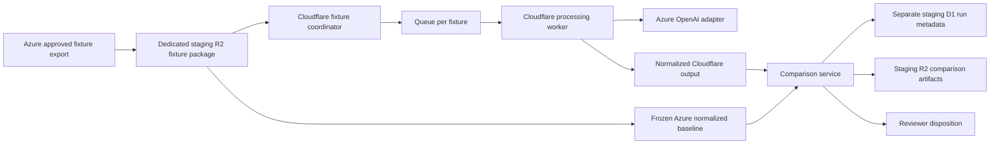

# Cloudflare Runtime Replacement and Parallel Comparison Plan

## Status and authority

**Status:** Proposed, no-change architecture plan.

This plan authorizes no deployment, source-code change, Azure configuration change, Cloudflare configuration change, secret creation, Microsoft Graph access, publishing change, or production cutover. Existing Azure writes and the completed Phase 1 Topic Memory pilot remain unchanged until separate implementation approval.

The current Azure Function remains the business publisher and the rollback system until an explicitly approved ownership switch.

## 1. Objective

Replace the current Azure Function PowerShell runtime with a Cloudflare-native processing runtime without weakening evidence handling, governance, or business-output quality.

The replacement is not a direct single-function port. The Azure timer wrapper invokes a large processing pipeline with three acquisition modes, map-reduce LLM processing, enrichment, people intelligence, validation, publication, and notifications. The Cloudflare design decomposes those responsibilities into isolated, recoverable components and proves parity before it obtains publishing authority.

The first comparison baseline uses Azure OpenAI from Cloudflare so that runtime migration and LLM-provider migration are evaluated separately. Workers AI remains a later independent adapter evaluation.

## 2. Non-negotiable safeguards

- Azure continues all current writes during fixture and Graph shadow stages.
- Cloudflare shadow processing has no SharePoint, Confluence, Teams, production D1, production R2, or canonical Topic Memory publishing authority.
- The replacement program uses a separate staging Worker, D1 database, R2 bucket, queues, secrets, and deployment configuration. It does not reuse Phase 1 staging resources.
- Fixture input is immutable and manually approved before it reaches Cloudflare.
- Fixture and comparison objects are retained for 30 days.
- Bucket access is restricted to the manual Azure exporter and the staging Cloudflare runtime. Human access uses audited deployment credentials only.
- Logs and comparison telemetry contain no raw transcript, prompt, LLM response, API key, Graph secret, SharePoint URL, Confluence URL, Teams payload, or legacy-sync response. They contain only IDs, versions, sizes, metadata, hashes, statuses, timings, token counts where available, and sanitized error classifications.
- Phase 1 canonical Topic Memory remains a separate service and is not made authoritative by this plan.

## 3. Target architecture



### 3.1 Components

| Component | Responsibility | Initial authority |
|---|---|---|
| Staging fixture coordinator | Validates an immutable manifest, records a run, and submits a job | Read from dedicated staging R2; write only replacement D1 and R2 |
| Queue | Decouples fixture scheduling from variable-duration processing and supports retry | Staging only |
| Per-fixture processor | Parses input, normalizes metadata, performs map-reduce processing, enrichment, people intelligence, validation, and publication-intent creation | No external publisher access |
| Provider-neutral LLM adapter | Converts a stable internal request/response contract to a provider-specific call | Azure OpenAI adapter first; Workers AI adapter evaluated separately |
| Comparison service | Normalizes Azure and Cloudflare artifacts, applies severity rules, writes a diff and disposition state | No publisher access |
| Replacement staging D1 | Holds fixture registry, run/job states, hashes, adapter metadata, comparison results, retries, and reviewer decisions | Dedicated to this program |
| Replacement staging R2 | Holds immutable fixture packages, Cloudflare normalized outputs, and comparison artifacts | Dedicated to this program |
| Future Graph acquisition adapter | Performs read-only discovery and transcript retrieval after fixture parity approval | Disabled until separate enablement approval |
| Future publisher adapters | SharePoint, Confluence, Teams, canonical Topic Memory, and legacy compatibility publishing | Absent or disabled through shadow stages |

### 3.2 Execution model

A scheduled trigger or explicit staging operator action creates a comparison run. The coordinator validates each manifest and stores an idempotency key derived from fixture ID, fixture manifest hash, runtime version, configuration snapshot hashes, and adapter identity. One queue message is created per fixture. The processor records state transitions and writes immutable run artifacts. Duplicate delivery returns the existing run result rather than producing a second artifact set.

This replaces the current single Azure timer process with independent per-fixture jobs while preserving observable retry and deduplication semantics.

### 3.3 Provider-neutral LLM contract

The processing core must depend on an internal adapter interface rather than on Azure OpenAI or Workers AI types. The interface must carry:

- prompt-template and processing-contract versions;
- model/deployment identity;
- system and user content internally only;
- response schema and parsed structured result;
- usage metrics when the provider supplies them;
- correlation ID;
- retryability and sanitized failure classification;
- deterministic request and response hashes for comparison tracing.

The first adapter calls Azure OpenAI directly from the staging Worker using environment-scoped secrets. The runtime records metadata and hashes only. Cloudflare AI Gateway is not part of the initial parity baseline and may be assessed later for routing, caching, and observability. Workers AI is a distinct provider-evaluation lane after runtime parity; it must not change the accepted Azure OpenAI runtime baseline.

## 4. Staging storage and access design

### 4.1 Dedicated resources

Create new, replacement-program-only staging resources:

- one staging Worker application;
- one staging D1 database for comparison metadata;
- one dedicated staging R2 bucket for fixture packages and comparison artifacts;
- one or more staging queues for fixture processing and retry handling;
- environment-scoped Worker secrets for Azure OpenAI and, later, Graph acquisition;
- separate deployment credentials and environment configuration.

No replacement resource may share the Phase 1 Topic Memory staging D1 database or R2 bucket.

### 4.2 R2 key layout

```text
fixtures/{fixture-id}/{manifest-sha256}/manifest.json
fixtures/{fixture-id}/{manifest-sha256}/input/transcript.vtt
fixtures/{fixture-id}/{manifest-sha256}/baseline/azure-normalized-output.json
fixtures/{fixture-id}/{manifest-sha256}/baseline/azure-publication-intent.json
fixtures/{fixture-id}/{manifest-sha256}/baseline/config-snapshot.json
runs/{run-id}/cloudflare-normalized-output.json
runs/{run-id}/cloudflare-publication-intent.json
runs/{run-id}/comparison.json
runs/{run-id}/comparison.md
```

Writes to the `fixtures` prefix are append-only for a given manifest hash. A correction creates a new manifest hash and therefore a new fixture revision; it never overwrites an approved package. Lifecycle configuration removes fixture packages and run artifacts after 30 days.

### 4.3 Fixture manifest contract

Each versioned fixture manifest must include at least:

- schema version;
- fixture ID and revision;
- source mode: calendar, VTT inbox, or direct VTT;
- source system and source-native identity;
- permitted non-sensitive source metadata needed for mode normalization;
- source event/meeting timing where applicable;
- transcript object key, byte size, MIME type, and SHA-256 hash;
- immutable Azure baseline output object keys and SHA-256 hashes;
- source acquisition and Azure processing versions;
- all relevant configuration, taxonomy, rule, prompt, model, and deployment identifiers or content hashes;
- publication-intent baseline;
- data classification;
- approval identity and approval timestamp;
- expiration timestamp set to 30 days after approval.

The manifest must exclude all credentials and external publication URLs. Azure fixture export includes every structured output needed to describe current behavior, including publication intent, but excludes actual SharePoint and Confluence URLs, Teams notifications, and legacy Cloudflare sync responses.

## 5. Azure behavior inventory and Cloudflare parity scope

| Azure behavior | Cloudflare parity behavior | First comparison stage |
|---|---|---|
| Calendar acquisition | Fixture supplies normalized calendar-derived source metadata and transcript; direct Graph acquisition deferred | Fixture corpus |
| VTT inbox acquisition | Fixture supplies inbox-derived metadata and transcript; inbox deletion deferred | Fixture corpus |
| Direct VTT processing | Fixture supplies direct VTT content and metadata | Fixture corpus |
| Deduplication | Idempotent run key and recorded prior state | Fixture corpus and recovery testing |
| VTT and text parsing | Equivalent parser with normalized transcript output | Fixture corpus |
| Meeting mode assignment | Equivalent rules and configuration snapshot | Fixture corpus |
| Map-reduce classification | Equivalent processing contract through Azure OpenAI adapter | Fixture corpus |
| Enrichment and history logic | Equivalent normalization, rules, and declared history fixture data | Fixture corpus |
| People intelligence | Equivalent extraction and resolution against approved non-secret configuration snapshot | Fixture corpus |
| Topic formatting and validation | Structured output first; rendered artifact comparison follows normalized semantic comparison | Fixture corpus |
| Publication intent | Calculate intended output locations/actions without calling publishers | Fixture corpus |
| SharePoint upload | Disabled | Only after cutover approval |
| Confluence mirror | Disabled | Only after cutover approval |
| Teams notification | Disabled | Only after cutover approval |
| Legacy Cloudflare sync | Disabled | Explicit compatibility decision before cutover |
| Graph discovery/download | Deferred; later read-only shadow | Direct Graph shadow |
| Inbox deletion | Deferred; never allowed in shadow | Cutover design only |

The initial fixture corpus contains successful cases from all three acquisition modes and includes multi-topic and people-attribution variation. Before direct Graph shadow, the corpus expands with no-transcript, duplicate, cooldown, validation-warning, unresolved-person, and comparable retry/failure cases.

## 6. Normalization and comparison policy

### 6.1 Baseline construction

Azure exports a manually approved immutable fixture package containing the transcript, metadata, configuration snapshot, every structured Azure output, and publication intent. Cloudflare processes the same input once and produces an equivalent normalized artifact. The comparison service compares Cloudflare against the frozen Azure baseline; it does not rerun Azure.

Both sides must be projected into a versioned normalized schema. The schema must represent source identity, input hashes, mode/classification, structured summary assertions, topics, context types, categories, decisions, actions, risks, ownership, people intelligence, validation results, provenance, publication intent, and sanitized execution metadata.

### 6.2 Severity bands

| Severity | Outcome | Examples |
|---|---|---|
| Blocking | Fixture fails parity | Source or transcript hash mismatch; invalid/missing normalized schema; missing required fact; fabricated fact; invalid controlled taxonomy value; changed publication intent; missing required validation; missing provenance |
| Material | Human review required | Changed topic, category, context type, decision, action, risk, owner, person attribution, confidence, or materially changed evidence-backed summary meaning |
| Permitted | Automatically accepted after normalization | Formatting-only variation; non-semantic ordering; run IDs; timestamps; wording-only differences that preserve every evidence-backed assertion |

A reviewer must record a disposition for every material difference: accepted equivalent, accepted intentional improvement, baseline defect, Cloudflare defect, or unresolved. An unresolved material difference blocks progression.

### 6.3 Fixture-to-Graph gate

Direct Graph shadow cannot begin until all of the following are true:

- zero blocking divergences across the approved fixture corpus;
- every material difference reviewed and dispositioned;
- successful duplicate, retry, and recovery testing for each approved fixture;
- expanded corpus covers no-transcript, duplicate, cooldown, warning, unresolved-person, and relevant failure cases;
- explicit approval is recorded to enable the Graph shadow stage.

## 7. Graph shadow design

### 7.1 Temporary identity decision

The initial direct Graph shadow may temporarily use the existing Azure application identity. That identity currently has write permission, so this is a deliberate residual risk, not a least-privilege end state.

The Cloudflare runtime must defend against that permission through code and configuration:

- Graph module implements only GET endpoints needed for calendar discovery, organizer lookup, meeting transcript discovery, and transcript download;
- endpoint allowlist is immutable and covered by automated tests;
- HTTP methods other than GET are rejected before request creation;
- no Graph write client, SharePoint publisher, Confluence publisher, Teams publisher, or inbox-deletion module is included in the shadow deployment;
- no SharePoint, Confluence, or Teams secret is bound to the shadow Worker;
- deployment checks fail if forbidden publisher bindings, routes, or endpoint patterns are present;
- logs record only sanitized request metadata and result hashes.

A single explicit approval enables scheduled direct Graph shadow runs after the fixture gate. A separate read-only Graph application remains the preferred future security improvement and should be introduced before publishing cutover if feasible.

### 7.2 Graph comparison

Graph shadow compares both acquisition and processing:

- discovered-meeting set and exclusion reason;
- organizer resolution;
- cooldown behavior;
- transcript availability and content hash;
- deduplication decision;
- processing and normalized output parity;
- non-publishing state confirmation.

Azure remains the actual business publisher throughout this stage.

## 8. Phased delivery and gates

### Phase A — Foundations and fixture contract

1. Define TypeScript domain schemas for manifests, normalized outputs, comparison results, reviewer dispositions, run state, and LLM adapter requests/responses.
2. Provision separate staging replacement resources only after implementation approval.
3. Build a manually operated Azure export procedure that packages approved input and frozen structured baseline output without changing Azure production behavior.
4. Implement lifecycle deletion at 30 days and access-control verification.
5. Create the first successful-case fixture corpus across calendar, VTT inbox, and direct VTT modes.

**Gate:** manifests validate, objects hash correctly, access is restricted, and no existing Azure or Phase 1 resource changes.

### Phase B — Cloudflare fixture processor

1. Implement parser, mode normalization, classification, enrichment, people, validation, and publication-intent modules.
2. Implement provider-neutral LLM adapter contract and direct Azure OpenAI adapter.
3. Implement D1 run state, queue dispatch, idempotency, retries, and R2 artifact output.
4. Keep all external publisher adapters absent or disabled.

**Gate:** Cloudflare can process every first-release fixture without an external publishing side effect.

### Phase C — Comparison and review workflow

1. Implement the versioned normalized schema and comparator.
2. Apply blocking, material, and permitted severity classifications.
3. Produce JSON and human-readable diff reports.
4. Record reviewer dispositions in replacement staging D1.
5. Add repeat/recovery tests and expand fixtures with operational edge cases.

**Gate:** zero blocking divergences, all material differences dispositioned, and successful repeat/recovery behavior across the expanded approved corpus.

### Phase D — Direct Graph shadow

1. Obtain one explicit approval to enable the stage.
2. Deploy the Graph read-only adapter with endpoint/method restrictions and automated forbidden-write tests.
3. Run scheduled non-publishing shadow comparisons.
4. Monitor acquisition coverage, processing parity, retries, and forbidden-side-effect checks.

**Gate:** direct Graph shadow satisfies agreed comparison acceptance criteria with no publisher side effect, and the residual identity risk is accepted or replaced by a least-privilege application.

### Phase E — Publishing readiness and reversible cutover

1. Define and test publisher adapters, publication idempotency, output naming, master-log semantics, notifications, and canonical service interactions in isolated staging.
2. Validate security, observability, support procedures, rollback execution, and historical reconciliation.
3. Obtain separate explicit approval to grant Cloudflare publishing authority.
4. Enable Cloudflare publishing, then disable the Azure schedule rather than deleting Azure.
5. Retain Azure deployment and configuration as the rollback system.

**Rollback:** disable Cloudflare publishing/schedule, re-enable Azure schedule, reconcile any partial run through the approved procedure, and retain comparison evidence. Do not delete either runtime or its data before an independently approved retirement decision.

## 9. Observability and review

Replacement D1 tracks run ID, fixture ID/revision, manifest and input hashes, runtime version, configuration/prompt hashes, adapter/model metadata, state transitions, retries, sanitized error class, comparison counts, and reviewer disposition. R2 stores immutable artifacts and reports until lifecycle expiry.

Required alerts and dashboards before Graph shadow include:

- failed or exhausted fixture jobs;
- manifest/hash validation failure;
- blocked parity divergence;
- unresolved material difference;
- prohibited publisher invocation attempt;
- prohibited Graph method or endpoint attempt;
- retry exhaustion;
- retention cleanup failure;
- missing expected comparison artifact.

## 10. Explicit non-actions until future approval

- Do not alter the Azure Function, its schedule, its configuration, or its existing writes.
- Do not remove Azure legacy Cloudflare sync.
- Do not enable Azure canonical Topic Memory dual-write.
- Do not alter Phase 1 staging Worker, D1, R2, secrets, or taxonomy state.
- Do not deploy production Cloudflare replacement resources.
- Do not grant Cloudflare publishing authority.
- Do not change Microsoft Graph permissions or create a Graph application.
- Do not access production SharePoint, Confluence, Teams, or canonical Topic Memory from the replacement shadow runtime.

## 11. Implementation approval requested

Implementation approval should be explicit and limited to Phases A through C unless the approver separately authorizes Graph shadow or publishing readiness. Approval must not be interpreted as authorization for direct Graph access, external publishing, Azure schedule changes, or cutover.
