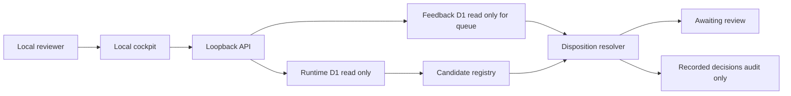

# Read-Only Composed Review Queue — POC Engineer Handoff

**Status:** Approved — final architect approval recorded 2026-08-12

## Final Approval Record

The implementation conforms to this handoff and is approved for normal SCM packaging, subject to isolating unrelated modified or untracked workspace files.

Validation evidence recorded at approval:

- Cockpit browser suite: 74/74 passed.
- Cockpit API suite: 61/61 passed.
- Local-server complete suite: 63/63 passed.
- Queue-focused server tests: 29/29 passed.
- Local-server typecheck and `git diff --check` passed.
- Independent third-party review disposition: PASS with no blocking conformance defects.

The approved boundary remains localhost-only, runtime-D1 read-only, feedback-D1 append-only, and excludes R2, transcript, credential, and storage-locator exposure.

## Topic Memory definition and authority boundary

A Topic Memory is a durable, canonical topic trajectory across one or more meetings. A processed topic initially creates one candidate memory. **Match** approves the candidate as a trajectory member: the Runtime Worker atomically marks the candidate `merged`, preserves it as provenance, and aggregates dates, latest classification/state, and meeting count into the target root. **No match** confirms an independent one-meeting Topic Memory.

The Local Cockpit browser performs constrained reads through the loopback server. The local server uses fixed `SELECT` queries against Runtime D1 and relays only the narrow Match/No match command to the Runtime Worker. The Runtime Worker is the sole write authority for Topic Memory decisions; the browser and local D1 adapter never write Runtime D1 directly. Active roots are the default Topic Memory view; merged source observations are provenance and must not count as additional trajectories.

## Objective

Add a localhost-only, read-only composed review queue. It must combine runtime candidates from production runtime D1 with reviewer dispositions from the isolated feedback D1 without modifying runtime D1.

The dashboard must show:

- **Awaiting review** by default: current candidate records without a matching disposition for their current source version.
- **Recorded decisions** only when the audit toggle is enabled: current candidate records with their newest matching current-version disposition.

A changed source version must automatically re-open a candidate. A feedback row for an earlier source version remains immutable audit history but must not suppress review of the newer version.

## Approved Decisions

| Area | Decision |
| --- | --- |
| Runtime candidate authority | Runtime D1 remains the sole authority for candidate status. |
| Current candidate registry | Only topic-memory records with `match_status = pending_review` are registered today. This is the sole actual source because the current schema defines no other `pending_review` field. |
| Future candidate sources | Use an explicit in-code registry so approved sources can be added later. Do not infer candidates from arbitrary feedback item types or generic statuses. |
| Feedback authority | Feedback D1 supplies reviewer dispositions only; it never changes runtime candidate status or source records. |
| Match identity | `item_type = memory`, `item_id = memory_id`, `source_kind = d1`, and exact `source_version = topic_memory.updated_at`. |
| Latest matching disposition | Select the newest matching feedback record using `created_at DESC`, then `feedback_id DESC` as deterministic tie-breaker. |
| Recorded disposition | Any existing feedback verdict may be the latest disposition, including a correction annotation. |
| Default dashboard presentation | Show Awaiting review. Hide Recorded decisions until the reviewer activates an audit toggle. |
| Version re-open | If the current runtime `updated_at` does not exactly equal a feedback row `source_version`, no current disposition exists and the candidate is Awaiting review. |
| Write boundary | No runtime D1 mutation, no runtime API mutation, no changed match status, and no feedback-schema migration are required. |

## Existing Constraints

- Preserve the local-only server boundary in [`packages/local-cockpit-server/src/server.ts`](../packages/local-cockpit-server/src/server.ts).
- Keep runtime reads structurally fixed-`SELECT` only in [`packages/local-cockpit-server/src/adapters/runtime-d1.ts`](../packages/local-cockpit-server/src/adapters/runtime-d1.ts).
- Keep feedback writes append-only in [`packages/local-cockpit-server/src/adapters/feedback-d1.ts`](../packages/local-cockpit-server/src/adapters/feedback-d1.ts).
- Do not include R2 keys, transcript hashes, raw transcripts, credentials, or storage locators in queue DTOs or UI.
- Do not use the runtime topic-memory mutation endpoint identified in [`packages/cloudflare-runtime/src/index.ts`](../packages/cloudflare-runtime/src/index.ts:267).

## Composed Data Flow



## Candidate Registry Contract

Create a typed, explicit registry local to the local-server composition layer. A registry entry must define:

- queue `itemType` used to match feedback;
- a stable identifier extractor;
- the current source-version extractor;
- the predicate that determines whether a runtime row is currently a candidate;
- a safe queue-card mapper that exposes only approved D1 business fields.

Initial and only registered entry:

| Queue item type | Runtime source | Candidate predicate | Stable ID | Current source version |
| --- | --- | --- | --- | --- |
| `memory` | `topic_memory` | `match_status === pending_review` | `memory_id` | `updated_at` |

The registry is an extension point, not an automatic discovery feature. Adding a source requires an explicit architecture decision, mapper, adapter query, tests, and UI display treatment.

## Queue DTO and API

Add `GET /api/v1/review-queue` to [`packages/local-cockpit-server/src/api/index.ts`](../packages/local-cockpit-server/src/api/index.ts).

The endpoint reads both D1 databases, composes in application memory, and must not issue writes. Return one response with explicit sections:

```ts
interface ReviewQueueResponse {
  generatedAt: string;
  awaitingReview: ReviewQueueItem[];
  recordedDecisions: ReviewQueueItem[];
}

interface ReviewQueueItem {
  itemType: 'memory';
  itemId: string;
  sourceKind: 'd1';
  sourceVersion: string;
  candidateStatus: 'pending_review';
  title: string;
  summary: string | null;
  entityType: string | null;
  entity: string | null;
  aspect: string | null;
  proposedMatchMemoryId: string | null;
  proposedMatchReason: string | null;
  updatedAt: string;
  disposition: ReviewDisposition | null;
}

interface ReviewDisposition {
  feedbackId: string;
  verdict: 'accurate' | 'incomplete' | 'incorrect' | 'irrelevant';
  affectedField: string;
  reviewerName: string;
  createdAt: string;
  correctsFeedbackId: string | null;
}
```

`awaitingReview` items must have `disposition: null`. `recordedDecisions` items must have a non-null disposition that satisfies the exact four-part match identity. Sort both groups by runtime `updatedAt DESC`, then `itemType`, then `itemId` for stable output.

The queue endpoint is the source of truth for queue grouping. The browser must not reimplement source-version comparison or latest-disposition selection.

## Composition Algorithm

1. Read the runtime rows needed by registered sources. Initially call `listTopicMemory` and retain only `pending_review` rows.
2. Read feedback D1 history through a narrow read method that returns only candidate-relevant feedback fields. The method must query feedback rows for `item_type = memory` and `source_kind = d1`, ordered by `created_at DESC, feedback_id DESC`.
3. Index feedback by `item_type`, `item_id`, and `source_version`.
4. For every current candidate, use its current `updated_at` as its source version and select the first row in its exact identity bucket.
5. No row in that exact bucket means Awaiting review.
6. A matching row means Recorded decisions.
7. Ignore feedback belonging to non-candidate item types, different source kinds, different item IDs, and old source versions for queue state. Preserve it in existing feedback-history and export endpoints.
8. Never call runtime write methods or runtime mutation endpoints.

## Required Server Changes

1. Extend [`packages/local-cockpit-server/src/adapters/feedback-d1.ts`](../packages/local-cockpit-server/src/adapters/feedback-d1.ts) with a narrow, read-only method for queue-relevant feedback. Keep all existing insert and historical read contracts intact.
2. Add queue-specific TypeScript DTOs and the explicit candidate registry under [`packages/local-cockpit-server/src/`](../packages/local-cockpit-server/src/). Avoid coupling this contract to the browser fixture types.
3. Add a pure composition function so candidate filtering, exact-version matching, deterministic latest-row resolution, grouping, and stable sorting can be unit tested without HTTP or D1.
4. Add the `GET /api/v1/review-queue` route in [`packages/local-cockpit-server/src/api/index.ts`](../packages/local-cockpit-server/src/api/index.ts). It must compose runtime and feedback reads server-side.
5. Update [`packages/exco-cockpit/public/app.js`](../packages/exco-cockpit/public/app.js) and [`packages/exco-cockpit/public/index.html`](../packages/exco-cockpit/public/index.html) to load and render a Review Queue area:
   - count and list Awaiting review;
   - default-hidden Recorded decisions audit panel;
   - accessible audit-toggle state and labels;
   - item context plus the disposition fields when recorded;
   - a clear statement that recorded decisions do not alter runtime state.
6. Retain existing feedback submission behaviour. On successful feedback submission, refresh the composed queue so an exact-current-version annotation moves the item to Recorded decisions without a page reload.
7. Update only status/handoff documentation necessary to record this approved POC behaviour.

## Required Tests

Add unit tests for the pure composition function:

- pending topic-memory candidate with no feedback is Awaiting review;
- exact matching identity produces a Recorded decision;
- a feedback record for a prior source version leaves the changed candidate Awaiting review;
- feedback for another item, type, or source kind does not match;
- multiple exact matches choose later `created_at`;
- equal timestamps choose descending `feedback_id` deterministically;
- a correction row is eligible and, if newest, becomes the displayed disposition;
- confirmed and rejected memory records are excluded regardless of feedback;
- unsupported feedback item types never become candidates;
- output sorting is stable.

Add API tests:

- endpoint response matches the two-section DTO and contains no forbidden storage-locator fields;
- only fixed runtime and feedback read methods are invoked;
- no runtime mutation method, write SQL, or runtime endpoint call occurs;
- feedback adapter query is scoped to registry-supported candidate sources;
- a new runtime source version re-opens a formerly recorded candidate.

Add browser tests:

- Awaiting review is visible by default;
- Recorded decisions are absent before the audit toggle is activated;
- activating the accessible audit toggle reveals recorded items and their reviewer/verdict context;
- after a successful qualifying feedback post, queue refresh moves the item from Awaiting review to Recorded decisions;
- default-hidden recorded content and queue rendering do not expose R2 or transcript locator values.

Run the local-server test suite and affected cockpit browser suite. The implementation must preserve existing loopback, no-Wrangler, runtime immutability, append-only feedback, and no-R2 tests.

## Acceptance Criteria

- The only active candidate source is topic memory where `match_status` is `pending_review`.
- Candidate discovery is explicit and registry-based; arbitrary feedback does not create queue items.
- The queue joins runtime and feedback data in the local server and performs no write to runtime D1.
- A recorded disposition matches only the exact current source version.
- Any newer runtime source version returns the item to Awaiting review automatically.
- The newest exact-match feedback row is selected deterministically.
- Awaiting review is visible by default; Recorded decisions require an audit-toggle action.
- Feedback history remains complete and immutable even when it does not affect current queue state.
- Queue DTOs and UI do not expose R2 keys, transcript hashes, raw transcripts, credentials, or generic D1 management responses.
- All listed unit, API, and browser tests pass alongside the existing POC boundary tests.
