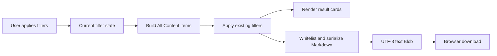

# New Feature Specification: Filtered All Content Markdown Export

**Status:** Implemented and verified locally (2026-08-18)

## 1. Objective

Add an **Export** control to the Cockpit **All Content** page. When a user applies one or more current filters and activates Export, the browser downloads a Markdown document containing precisely the items that pass the existing All Content filtering logic.

The export is a client-side convenience feature. It does not create server-side records, call a new API endpoint, mutate source data, persist export history, or fetch evidence.

## 2. User story

> As a Cockpit user, I want to filter All Content and export the matching content as a Markdown file, so that I can share or work from the current filtered view outside the Cockpit.

## 3. Scope and non-goals

### In scope

- Add an **Export** button in the All Content filter area.
- Reuse the same `buildAllItems` and `applyFilters` flow used by the rendered All Content result list, so the export has the same inclusion semantics as the current view.
- Include all safe structured fields available for each exported meeting, topic, decision, action, risk, and canonical Topic Memory.
- Include export metadata: generation time, result count, and active filters.
- Generate and download a UTF-8 Markdown file directly in the browser.
- Provide accessible labels and status feedback.
- Add browser DOM tests for export behavior and content boundaries.

### Out of scope

- Server-side export endpoints, asynchronous jobs, storage, sharing links, audit trails, or export history.
- Raw transcript content, transcript snippets, evidence bodies, or evidence modal content.
- Storage locators and internal storage metadata, including R2 keys and transcript hashes.
- Feedback notes, reviewer identity, feedback history, or any other retained feedback fields.
- Changing filtering rules, ordering rules, Cockpit DTOs, or source records.
- Exporting hidden merged Topic Memory observations as independent top-level items. They remain branches beneath their canonical root.

## 4. Current integration points

The feature belongs to the static browser UI:

- Add the control beside **Clear all** in [`packages/exco-cockpit/public/index.html`](../packages/exco-cockpit/public/index.html:119).
- Reuse the canonical filtered item list calculated in [`renderAllContent()`](../packages/exco-cockpit/public/app.js:458), which relies on [`buildAllItems()`](../packages/exco-cockpit/public/app.js:260) and [`applyFilters()`](../packages/exco-cockpit/public/app.js:361).
- Add browser-side Markdown serialization and download handling to [`packages/exco-cockpit/public/app.js`](../packages/exco-cockpit/public/app.js:458).
- Add layout, disabled, focus, and status styles to [`packages/exco-cockpit/public/styles.css`](../packages/exco-cockpit/public/styles.css:531).
- Extend existing jsdom browser coverage in [`packages/exco-cockpit/src/browser.test.ts`](../packages/exco-cockpit/src/browser.test.ts:381).

No API-worker or local-server change is required.

## 5. UX and accessibility requirements

### Button placement and label

1. Place a button labelled **Export** next to **Clear all** in the All Content filter bar.
2. Use the existing secondary-button visual language.
3. Assign `id="all-content-export"` and an accessible name that describes its effect, such as `Export filtered content as Markdown`.
4. The button is available only in the All Content panel and is not included in any downloaded content.

### Enabled state

1. After All Content data has loaded, enable Export when the current filter result has one or more items.
2. Disable Export while data is unavailable or when the current filters return zero items.
3. Set both the native `disabled` property and `aria-disabled` state when disabled.
4. Update its enabled state during every All Content render, including filter changes, filter clearing, and overview-card deep links.

### Activation and status

1. A pointer click or keyboard activation starts an immediate browser download.
2. The control does not navigate away, open a modal, or cause a network request.
3. Add a dedicated polite live-region status element in the filter bar, separate from the existing result-count status. On success it announces the exported item count and filename.
4. If the browser cannot construct or trigger the download, keep the current filtered result view intact and announce a non-sensitive error through the status region. The implementation may also log the error to the browser console.

## 6. Export contract

### 6.1 Inclusion and ordering

1. At click time, recompute `allItems = buildAllItems()` and `filteredItems = applyFilters(allItems)`. Do not scrape rendered card HTML and do not reuse a potentially stale DOM count.
2. Export exactly `filteredItems` at that instant.
3. Preserve current All Content grouping and ordering:
   - Meeting
   - Topic
   - Topic Memory
   - Decision
   - Action
   - Risk
4. Within each type group, preserve the source-derived item order returned by the existing All Content builder.
5. A user who has not selected a filter exports all current All Content items; the term filtered means the current result set, including the unfiltered result set.
6. A deep-link state filter from Overview is part of the effective filter state and must constrain the export identically to the rendered result list.

### 6.2 Metadata

The document begins with this structure:

```md
# EIP ExCo Cockpit Content Export

- Exported at: 2026-08-17T09:43:08.261Z
- Results: 12
- Active filters:
  - Type: Decision
  - Meeting: All meetings
  - Domain: Finance
  - Entity family: All entity types
  - Keyword: `margin`
  - Topic Memory scope: All Topic Memories
  - State: None
```

Rules:

1. `Exported at` is a UTC ISO-8601 timestamp from the export operation.
2. `Results` is the exact `filteredItems.length` used to create the file.
3. List all user-selectable filters every time. Represent no selection with the UI's All value, not a blank field.
4. Include the internal deep-link state filter as `State`; use `None` when absent.
5. Use the selected meeting's complete subject and meeting ID when a meeting is selected, avoiding the truncated subject used in the visual filter summary.
6. Render keyword values in inline code and safely escape Markdown delimiters.

### 6.3 Filename

The downloaded filename must be:

```text
eip-exco-cockpit-export-YYYY-MM-DDTHH-mm-ssZ.md
```

Generate the timestamp from the same export-operation UTC time used for document metadata, remove milliseconds, and replace time colons with hyphens. Example: `eip-exco-cockpit-export-2026-08-17T09-43-08Z.md`.

### 6.4 Markdown hierarchy

```md
# EIP ExCo Cockpit Content Export

<metadata>

## Meetings

### Meeting: Commercial & Finance

- ID: `fx-meeting-001`
- Organiser: ...
...

## Topics

### Topic: ...
...
```

1. Omit empty type sections.
2. Use level-2 headings for type groups and level-3 headings for individual records.
3. Use readable labels and bullet lists for scalar fields.
4. Use nested bullet lists for arrays and structured values such as validation reasons, assertions, and Topic Memory trajectory branches.
5. Escape user- or data-derived Markdown punctuation in headings, bullet values, inline code, and list values so that content cannot alter document structure.
6. Preserve line breaks in text values without permitting those values to introduce headings, lists, or other unintended Markdown syntax.
7. Represent `null`, `undefined`, empty values, and the `Not extracted` sentinel consistently as `Not extracted`.
8. Format booleans, counts, statuses, and ISO dates as their safe string value. Do not localize or derive dates.

### 6.5 Per-type safe field set

The exporter must whitelist fields. It must not serialize a raw object or use a broad object-spread approach because future DTO additions might introduce prohibited data.

| Type | Include |
| --- | --- |
| Meeting | meeting ID, subject, organiser, event date, topic count, decision count, action count, validation status |
| Topic | topic ID, meeting ID, taxonomy fields: domain, entity type, entity, aspect, outcome, disposition, executive scope; topic statement; summary; owners; accountable executive; confidence; validation status and reasons; key facts; risk assertions |
| Decision | decision ID, meeting ID, topic ID, owner, decision text, enriched meeting subject and event date, linked topic statement, domain, entity type, entity, and evidence context label/text supplied by the safe Cockpit DTO |
| Action | action ID, meeting ID, topic ID, owner, action text, due date, status, enriched meeting subject and event date, linked topic statement, domain, entity type, and entity |
| Risk | risk ID, meeting ID, topic ID, risk text, topic statement, owner, topic domain, entity type, entity, evidence label, risk kind, and supporting evidence assertions |
| Topic Memory | memory ID, domain, entity type, entity, aspect, canonical statement, first and last meeting IDs and dates, meeting count, latest outcome, disposition and executive scope, match status, proposed-match statement/ID/reason, merged-into ID, review-resolution timestamp/event ID, updated timestamp, status, and each attached trajectory branch using the same safe Topic Memory fields |

Explicit exclusions for all types: evidence-detail URLs; raw transcript-derived evidence bodies; transcript snippets; storage locators; storage hashes; credentials; feedback annotations; reviewer names; and browser-only internal fields beginning with `_`.

The decision `evidenceContext` is permitted only because it is a safe structured DTO field rather than an evidence endpoint response. Do not dereference `evidenceDetailUrl`, request evidence, or append any evidence-body data.

### 6.6 Suggested record presentation

Use the following consistent field layout; types may omit fields that are not applicable.

```md
### Action: Confirm Q3 pricing governance

- ID: `fx-action-001`
- Meeting ID: `fx-meeting-002`
- Topic ID: `fx-topic-004`
- Meeting: Commercial & Finance
- Meeting date: 2026-07-22T11:00:00.000Z
- Owner: CFO
- Due date: 2026-08-01
- Status: open
- Domain: Finance
- Entity type: Metric
- Entity: Gross margin
- Topic statement: ...
- Text: Confirm Q3 pricing governance
```

For structured lists:

```md
- Validation:
  - Status: warning
  - Reasons:
    - Missing accountable executive
- Key facts:
  - `fact-1`: Revenue was...
- Trajectory branches:
  - Memory ID: `fx-memory-003`
    - First seen: 2026-07-01
    - First meeting ID: `fx-meeting-001`
    - Canonical statement: ...
```

## 7. Implementation design



### 7.1 Browser functions

Implement small, testable browser functions near the All Content rendering code:

1. A function that computes the current `{ allItems, filteredItems }` from the existing builder and filter functions.
2. A function that converts current filter state into safe, complete export metadata.
3. Markdown escaping and formatting helpers for text, inline-code values, absent values, scalar bullet rows, and assertion lists.
4. One explicit serializer per supported type, dispatched by `_type`.
5. A top-level `buildFilteredContentMarkdown(filteredItems, exportedAt)` function that returns the complete document text and filename-relevant timestamp.
6. An export handler that creates `new Blob([markdown], { type: 'text/markdown;charset=utf-8' })`, creates a temporary object URL, clicks a temporary anchor with `download`, removes the anchor, revokes the object URL, and writes the status announcement.
7. A function that updates the Export button state as part of `renderAllContent()`.

Do not add a dependency solely for Markdown generation. The existing plain browser JavaScript is adequate and the whitelist remains easier to review with explicit serializers.

### 7.2 Risk derivation and Topic Memory behavior

- Export the same canonical and evidence-only risks produced by the existing risk derivation path. Preserve `kind`, `evidenceLabel`, and `supportingEvidence` so recipients understand whether a record is a canonical risk or evidence-only proxy.
- Export a Topic Memory root exactly once. Its merged observations are exported beneath it under `Trajectory branches`, matching the UI's root-and-branch model.
- The current Topic Memory meeting filter includes roots when any stored first or last meeting ID from the root or branches matches. Export must reuse this existing behavior rather than attempting a second interpretation.

## 8. Acceptance criteria

1. The All Content filter bar presents an accessible Export button adjacent to Clear all.
2. With loaded data and at least one result, clicking Export downloads one `.md` file without a network request or source-data mutation.
3. The filename follows `eip-exco-cockpit-export-YYYY-MM-DDTHH-mm-ssZ.md` and has no milliseconds or filename-invalid time colons.
4. The document reports the UTC export time, exact result count, and all effective filter values, including deep-link state where present.
5. A type, keyword, meeting, domain, entity-family, Topic Memory scope, or deep-link state filter produces an export whose record IDs exactly match the visible result set for the same state.
6. With no selected filters, the file contains all current All Content items and metadata reports All values.
7. The export groups records in the current All Content order and omits groups without matching records.
8. Every exported record contains only explicitly whitelisted safe fields for its type.
9. The Markdown never contains raw transcript content, evidence bodies, evidence-detail URLs, R2 keys, transcript hashes, credentials, feedback notes, reviewer names, or browser internal `_` fields.
10. Topic Memory roots are exported once and their branches are nested under the root; merged branches are not separate top-level records.
11. `Not extracted`, null, undefined, and empty fields are rendered consistently without emitting JavaScript string values such as `undefined`.
12. When no records match, Export is disabled, has `aria-disabled="true"`, and no download is triggered.
13. Screen-reader users receive a polite success or failure status message.
14. Existing filter behavior, result counts, feedback behavior, and evidence behavior remain unchanged.

## 9. Verification plan

Extend [`packages/exco-cockpit/src/browser.test.ts`](../packages/exco-cockpit/src/browser.test.ts:381) using its existing jsdom `URL.createObjectURL` and `URL.revokeObjectURL` mocks.

Required tests:

1. Export control exists, has an accessible name, and is enabled after initial data load with results.
2. Export control becomes disabled for a keyword query with zero results and does not call `URL.createObjectURL` when activated.
3. Export after a Decision filter creates a Markdown Blob with Decision records only, count parity with the rendered card count, and the selected type in metadata.
4. Export after a conjunctive filter verifies result-ID parity with `applyFilters`, including meeting, domain, entity family, and keyword state.
5. Export through an Overview deep link includes the effective state filter and only the linked visible records.
6. Metadata contains UTC time, count, full active-filter values, and the generated filename pattern.
7. Serialization includes representative structured Topic fields and nested validation/assertion lists.
8. Serialization includes a Topic Memory root once and nests trajectory branches.
9. Serialization excludes representative prohibited values: evidence URLs, feedback fields, raw evidence response fields, R2 key, transcript hash, and properties prefixed with `_`.
10. A successful export announces the count and generated filename; a simulated download failure announces a failure while leaving the results intact.
11. Run the existing Cockpit test command from [`packages/exco-cockpit/package.json`](../packages/exco-cockpit/package.json:5): `npm test`.

## 10. Implementation checklist

- [x] Add the Export button and a dedicated polite export-status live region to [`packages/exco-cockpit/public/index.html`](../packages/exco-cockpit/public/index.html:120).
- [x] Add responsive filter-bar styling for the new control and export-status message to [`packages/exco-cockpit/public/styles.css`](../packages/exco-cockpit/public/styles.css:531).
- [x] Implement export-state calculation, safe field whitelist serializers, Markdown helpers, Blob download lifecycle, and error/status handling in [`packages/exco-cockpit/public/app.js`](../packages/exco-cockpit/public/app.js:393).
- [x] Ensure [`renderAllContent()`](../packages/exco-cockpit/public/app.js:673) updates Export enablement based on its exact filtered result set.
- [x] Add and pass jsdom browser coverage in [`packages/exco-cockpit/src/browser.test.ts`](../packages/exco-cockpit/src/browser.test.ts:307).
- [x] Run Cockpit tests and type checking; inspect the generated Blob, metadata, filename, and download lifecycle through jsdom coverage.
