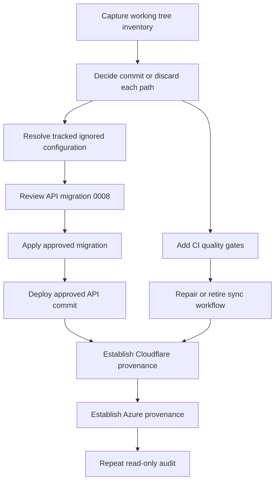

# Live platform audit remediation backlog

**Source audit date:** 2026-08-13  
**Current decision:** `GAP` — do not assert that the project is fully committed, pushed, merged, and deployed.  
**Scope:** Remediate the verified audit findings without changing approved product scope or promoting deliberately deferred systems.

## Guardrails

- Keep the Azure Function + PowerShell + SharePoint path as the production system of record.
- Do not deploy the synthetic ExCo cockpit or localhost-only cockpit as part of this remediation.
- Do not apply D1 migration `0008_topic_summary_variants.sql` until its SQL, affected code, rollback/recovery strategy, and production impact have been explicitly approved.
- Do not expose or commit credentials, tokens, connection strings, webhook URLs, or other secret values.
- Every deployment must be associated with an immutable Git commit SHA, visible CI result, deployment timestamp, and deployed-service version identifier.

## Recommended execution order

## Backlog

| ID | Priority | Owner | Work item | Dependencies | Acceptance criteria | Deployment gate |
| --- | --- | --- | --- | --- | --- | --- |
| AUD-01 | P0 | Product owner + developer | Triage the 17 modified files and 16 untracked paths observed by the audit. Categorise each as commit, intentionally local/ignored, or discard. Do not use a blanket add/commit. | None | Working tree is clean, or every remaining local path is explicitly intentionally ignored and documented. No secrets or production artifacts are committed. | Blocks any assertion of repository completeness and all new deployments from this checkout. |
| AUD-02 | P0 | Developer + security reviewer | Resolve the tracked-and-ignored [`packages/pipeline/pipeline_config.json`](../packages/pipeline/pipeline_config.json) state. Decide whether the committed file is a fully sanitised production-default template or must become untracked and be generated/provisioned at deployment. Align [` .gitignore`](../.gitignore) and [`deploy-pipeline.yml`](../.github/workflows/deploy-pipeline.yml) with that decision. | AUD-01 | `git check-ignore -v` and `git ls-files -ci --exclude-standard` produce no tracked ignored configuration file. CI/deployment still receives only safe non-secret configuration. | Blocks pipeline deployment until configuration provenance and secret separation are clear. |
| AUD-03 | P0 | API owner + database reviewer + product owner | Review [`0008_topic_summary_variants.sql`](../packages/d1/migrations/0008_topic_summary_variants.sql) and its matching API code. Prepare migration impact, preflight query, backup/recovery approach, and post-apply verification. Explicitly approve or reject production application. | AUD-01; schema/code review | Written approval identifies target database, expected schema change, recovery action, and verification query. Staging remains clean after rehearsal. | Production API deployment is blocked while the deployed schema and migration ledger diverge. |
| AUD-04 | P0 | Developer | Following AUD-03 approval, apply migration `0008` to production using the approved, audited command and verify the production migration ledger. Record the execution timestamp, operator, command class, result, and D1 migration output without secrets. | AUD-03 | `wrangler d1 migrations list eip-platform --remote` reports no pending migrations; expected API smoke checks pass. | Required before claiming API Worker data schema is current. |
| AUD-05 | P1 | Release owner | Establish API Worker deployment provenance. Deploy only an approved commit after CI succeeds, then capture GitHub run URL, commit SHA, Worker version ID, deploy timestamp, and relevant smoke-check result in a release record. | AUD-03/AUD-04 if migration is needed; CI gate from AUD-07 | Latest active API Worker version is traceable to an approved main SHA and successful deployment run; no unexplained gap remains between latest version and current intended release. | Required to upgrade API Worker from `UNVERIFIED` to `PASS`. |
| AUD-06 | P1 | Release owner | Establish Cloudflare runtime provenance for `eip-cloudflare-runtime`. Determine the actual deployment mechanism, identify the release commit for active version `3d7bcd46-749c-46f8-8cbf-b2a8dd9e59a1`, and record the same immutable evidence tuple. Add a controlled deployment workflow only if that is the approved release mechanism. | AUD-07 if new workflow is added | Active runtime version is traceable to an approved commit, successful validation, timestamp, and operator/workflow. Documentation matches the actual release process. | Required to upgrade runtime deployment from `UNVERIFIED` to `PASS`. |
| AUD-07 | P1 | Developer | Expand [`ci.yml`](../.github/workflows/ci.yml) so every maintained executable package has reproducible validation: Cloudflare runtime tests, runtime-shadow tests, ExCo cockpit tests, existing local cockpit tests, and API typecheck. Add a non-mutating Wrangler configuration/deploy dry-run only where authentication/CI policy permits it. | AUD-01 | Required test suites run on pull requests and `main`, use lockfile-based installs, and pass for the release SHA. Failures block deploy workflows through explicit `needs` or branch protection. | Becomes prerequisite for future production deployments. |
| AUD-08 | P1 | Repository maintainer | Retire or implement [`deploy-sync-worker.yml`](../.github/workflows/deploy-sync-worker.yml). Preferred current action: remove the placeholder because [`packages/sync-worker/`](../packages/sync-worker/) does not exist. If retained, create the package and working deployment path in a separately approved initiative. | AUD-01 | No production-named deployment workflow silently succeeds while doing nothing; workflow inventory reflects maintained packages only. | Blocks a clean operations/housekeeping sign-off. |
| AUD-09 | P1 | Release owner + Azure owner | Establish Azure Function App deployment provenance. Link the app last-modified/deployment evidence to a successful `Deploy Pipeline to Azure Functions` workflow and approved commit. Determine why current `main` is newer than successful run `31382433321` at SHA `2ab0536b…`; deploy only if changed pipeline paths and release policy require it. | AUD-02; AUD-07 | Azure release record contains function app, commit SHA, GitHub run URL, deployment timestamp, and non-secret post-deploy health evidence. A deliberate no-deploy decision is documented when path filters mean no pipeline change. | Required to upgrade Azure deployment correlation from `UNVERIFIED` to `PASS`. |
| AUD-10 | P2 | Repository maintainer | Reconcile operational documentation. Update [`CHANGELOG.md`](../CHANGELOG.md) with 2026-08 changes or label it historical and point readers to [`plans/STATUS.md`](STATUS.md) and the runtime handover for operational release history. | AUD-05, AUD-06, AUD-09 | One authoritative, current record states component release status, deferred systems, and latest release evidence without contradictions. | Required for documentation housekeeping sign-off. |
| AUD-11 | P2 | Product owner | Reconfirm ownership and approval status for intentionally deferred work: ExCo deployment, staging runtime deployment, topic-match acceptance implementation, Confluence 404 resolution, and legacy runtime-shadow decommissioning. | None | [`plans/STATUS.md`](STATUS.md) names owner, current disposition, and approval gate for each deferred item. | Does not block current production remediation unless a deferred item affects current data integrity or security. |
| AUD-12 | P0 | Independent reviewer | Repeat the read-only live audit using [`live-platform-audit-runbook-2026-08-13.md`](live-platform-audit-runbook-2026-08-13.md) after AUD-01 through AUD-09 complete. | AUD-01 through AUD-09 | New evidence package has no unaddressed P0/P1 `GAP`; deferred systems are classified `EXPECTED-DEFERRED`; live components have verified provenance. | Required before making the global completeness assertion. |

## Explicitly not in this remediation release

| Item | Audit classification | Reason |
| --- | --- | --- |
| Synthetic ExCo cockpit deployment | `EXPECTED-DEFERRED` | The approved status explicitly says synthetic-only and not deployed. Cloudflare Access and separate approval are required before any preview or production promotion. |
| Local live-data cockpit deployment | `EXPECTED-DEFERRED` | The local service is constrained to loopback use and explicitly requires separate production architecture approval. |
| Runtime staging deployment | `EXPECTED-DEFERRED` | Staging resources exist, but the documented status says the Worker is not deployed there. Promote only under a separate approved staging plan. |
| Topic-match acceptance merge | `EXPECTED-DEFERRED` | The endpoint intentionally returns `501` pending Phase 6 design/implementation. |
| Confluence mirror 404 | `EXPECTED-DEFERRED` | Known non-blocking issue; should be separately scoped unless the mirror is declared production-critical. |
| Runtime-shadow decommissioning | `EXPECTED-DEFERRED` | Await proof/stability criteria for the current runtime and an approved retirement procedure. |

## Sign-off checklist

Do not change the overall audit decision from `GAP` to `PASS` until an independent reviewer can mark every applicable item below:

- [ ] Working tree and remote parity meet the selected release policy.
- [ ] No tracked file is ignored as a local/secret configuration file.
- [ ] API production D1 has no unapplied intended migration.
- [ ] Current active API Worker version has immutable release provenance.
- [ ] Current active runtime Worker version has immutable release provenance.
- [ ] Azure Function App deployment has immutable release provenance or a documented path-filter no-deploy decision.
- [ ] Maintained packages are validated in CI before deployment.
- [ ] Placeholder/dead deployment workflow is removed or fully implemented.
- [ ] Status, changelog, and handover documentation agree on live/deferred scope.
- [ ] A repeated read-only audit verifies the above without `P0` or `P1` gaps.
