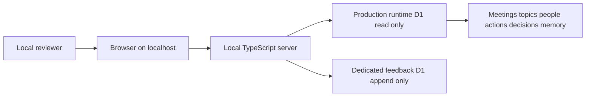

# Local Live-Data Cockpit and Feedback POC Plan

**Status:** Implemented — credential provisioning approved 2026-08-11

**Approved scope (see revised section below):** D1 live data + append-only feedback only. No R2 access, credentials, or exposed storage locators in this POC.

## Objective

Extend [`packages/exco-cockpit/`](../packages/exco-cockpit/) into a **localhost-only** review POC that:

- reads the current production Cloudflare runtime D1 without source writes;
- displays live D1-derived data only in the local cockpit UI and API (R2 is not used — see Approved scope);
- persists reviewer quality feedback to a new dedicated remote D1 database;
- retains all runtime source records and topic-memory records unchanged; and
- explicitly defers any production-deployable cockpit design.

## Approved decisions

| Area | Decision |
| --- | --- |
| Execution | A separate local API-client server only. No remote Worker execution, preview, or deployment. |
| Source data | Direct, read-only-in-code access to current production runtime D1 (all tables). R2 is not used — see Approved scope section. |
| Raw content | D1-derived business fields only. R2 and transcript content are not accessed. Storage locators (r2_output_key, transcript_sha256) are excluded from all DTOs and API responses. |
| Runtime records | Immutable to the cockpit: no writes to meetings, topics, people, actions, decisions, or topic memory. |
| Feedback authority | Append-only quality annotations only; feedback does not automatically update source records or memory. |
| Feedback storage | New dedicated remote D1 database, accessed by the localhost server only. |
| Reviewer identity | Every submission requires an explicit reviewer display name. |
| Retention | Indefinite for this POC. |
| Feedback notes | Free text is allowed after a prominent warning not to paste transcripts or sensitive source material. The accepted risk is that the retained feedback store could contain such material. |
| Production | Deferred to a separately approved architecture with a restricted read model, identity enforcement, and no accidental promotion of this POC. |

## Architecture

## Feedback effect on records and topic memory

A feedback submission is a separate immutable annotation. It records the reviewed item identity, its source version/provenance, reviewer display name, verdict, affected field, free-text note, and timestamp. It **does not** update any runtime source table.

| Source entity | What feedback can say | Automatic effect |
| --- | --- | --- |
| Meeting | Metadata or processing output is inaccurate, incomplete, incorrect, or irrelevant | None |
| Topic | Classification, summary, owner, evidence, or validation is inaccurate or incomplete | None |
| Action | Owner, due date, status, linkage, or action text is inaccurate or incomplete | None |
| Decision | Owner, wording, linkage, or evidence is inaccurate or incomplete | None |
| Topic memory | Canonical statement, trajectory, classification, status, or candidate match looks wrong | None |
| *(Not applicable in this POC)* | Transcript and meeting-output content are not accessed. The feedback itemType contract covers only: meeting, topic, action, decision, memory. | — |

In particular, topic-memory feedback will **not** change `match_status`, create/accept/reject a merge, update its canonical statement, alter first/last-seen values, or alter meeting count. The current runtime endpoint implements only match rejection and returns `501` for acceptance; it remains outside this POC in [`packages/cloudflare-runtime/src/index.ts`](../packages/cloudflare-runtime/src/index.ts:267).

## Implementation plan

1. **Create an explicit local-only runtime boundary.**
   - Add a local Node/TypeScript server entry point beside the current Worker-facing cockpit code.
   - Bind only to loopback; reject non-loopback host headers.
   - Add package scripts that run the local server and make `wrangler deploy`, previews, and remote Worker development fail while raw-data mode exists.
   - Document that this path cannot be used for production or Cloudflare Access review.

2. **Create a separate local-server package and enforce local execution.**
   - Create a distinct local-server package or entry point that does not import the Worker entry point or use [`packages/exco-cockpit/wrangler.jsonc`](../packages/exco-cockpit/wrangler.jsonc).
   - Bind only to loopback and reject non-loopback host headers.
   - Keep production D1 and feedback-D1 credentials in ignored local environment files available only to the local server process. No R2 credentials are held or used.
   - Remove or hard-fail raw-data-mode `dev` and `deploy` package scripts that invoke Wrangler; document that manual invocation of Wrangler is outside the application's technical control.
   - Add a CI check that fails if a raw-data local-server package contains a Wrangler configuration, Worker binding configuration, or deployment script.

3. **Create least-privilege local credentials and configuration.**
   - Configure local-only environment variables that are ignored by Git.
   - Use a separately approved credential for production runtime D1 reads and a distinct credential scoped only to the new feedback D1 database. No R2 credentials are required.
   - Make the D1 adapter structurally read-only: permit only fixed `SELECT` statements; do not implement generic query, put, delete, or source-update methods.
   - Record the credential scope and expiry in a local operator runbook. Cloudflare API-token permissions may not enforce SQL `SELECT`-only access for D1; the source read-only guarantee is therefore defence in depth, not a complete protection against a compromised local credential.
   - Ensure browser code never receives credentials, account IDs, or management API responses beyond the cockpit DTOs.

4. **Perform the production-source pre-flight check.**
   - Confirm that an approved recoverable backup or export of the production runtime D1 database exists before local POC access is enabled.
   - Record database ID, snapshot/export reference, timestamp, operator, and the expected source record counts in a local run log.
   - Run fixed baseline `SELECT` counts before the POC session; repeat them afterward and investigate any difference.
   - Do not start the POC if the backup/snapshot, credentials, or baseline checks are absent or fail.

5. **Implement read-only source adapters.**
   - Implement a production runtime D1 adapter for meetings, topics, people, actions, decisions, and topic memory.
   - Expose explicit DTOs rather than passing raw database/API rows through unmodified. Storage locator columns (r2_output_key, transcript_sha256) are excluded from all DTOs.
   - Ensure the D1 adapter includes no write operations and accepts no source-write credentials. No R2 adapter is implemented.

6. **Map live records to cockpit APIs and UI.**
   - Replace fixture-backed data sources in [`packages/exco-cockpit/src/api.ts`](../packages/exco-cockpit/src/api.ts) with local live-data services while retaining the existing Overview and All Content interactions.
   - Surface source provenance, D1 record identifiers, timestamps, runtime version, and processing metadata where present. R2 keys are not surfaced.
   - Distinguish absent source values from unavailable data and failed fetches.

7. **Provision and migrate the isolated feedback database.**
   - Create a dedicated remote D1 database that is not the runtime database.
   - Add a dedicated migration directory and an append-only feedback table.
   - Require: feedback ID, item type, item ID, source kind, source version/provenance, reviewer display name, verdict, affected field, note, warning acknowledgement, created timestamp, and optional source-location metadata.
   - Do not provide update/delete endpoints. Corrections are additional annotations that reference a prior feedback ID.
   - Provide read, filtered-list, and JSON/CSV export endpoints; no source-record write endpoint.

8. **Implement persistent feedback UI.**
   - Require a reviewer display name, verdict, affected field, non-empty note, and explicit acknowledgement of the no-transcript warning before submission.
   - Explain that notes are retained indefinitely and must not reproduce raw transcripts or sensitive material.
   - Display submission success, feedback history per reviewed item, and globally filtered review history.
   - Preserve the existing four verdicts: accurate, incomplete, incorrect, and irrelevant.

9. **Prove immutability and containment.**
   - Unit-test that the runtime D1 adapter issues no write request and has no write method.
   - Integration-test all local read endpoints against mocked live-service clients.
   - Integration-test that feedback writes target only the dedicated feedback D1 and are append-only.
   - Test required reviewer name, note, and warning acknowledgement.
   - Test feedback on topic-memory items does not call the runtime topic-memory mutation endpoint or modify any memory fields.
   - Test non-loopback and deploy/remote-dev guards fail closed.

10. **Run local verification and document the new boundary.**
   - Authenticate local credentials, run the server on loopback, and inspect representative live D1 records.
   - Submit and export feedback while confirming runtime D1 source records remain query-equivalent before and after review.
   - Update [`plans/STATUS.md`](STATUS.md) and [`plans/exco-cockpit-session-state-2026-08-11.md`](exco-cockpit-session-state-2026-08-11.md) to supersede the synthetic-only cockpit boundary for this specifically approved localhost POC.
   - Document that production remains deferred and needs a new approval and data-minimised design.

## Operational limitations and residual risks

- The cockpit source path is intentionally **not production-safe**. It displays live D1-derived data and has no end-user identity or centralized access control.
- The local server restricts its own code to fixed read operations. This does not make an over-permissioned Cloudflare API token physically read-only: compromise of a local credential can permit actions allowed by its Cloudflare scope.
- Package-script and CI guards prevent supported project workflows from deploying raw-data code, but no repository check can prevent an authorized developer from manually running external deployment commands. Operational policy and credential control remain required.
- Reviewer notes are permanently retained and may contain sensitive content despite the warning. The separate feedback D1 is therefore sensitive and requires equivalent operational handling.
- Any source-data difference detected in the post-session baseline comparison is an incident until explained; the cockpit must not be treated as the source of truth or as a recovery mechanism.

## Approved scope (revised)

**D1 live data + append-only feedback only. No R2 access, credentials, or exposed storage locators in this POC.**

R2 access is not implemented and no R2 credentials are provisioned. The management API listing endpoint's response contract (`truncated`/`cursor`/`objects`) is documented only for the Workers `R2Bucket` binding, not the REST API. The S3-compatible API requires AWS Signature Version 4 (needs R2 access-key ID + secret and a signing library). A Workers relay would violate the approved no-remote-execution boundary. Storage locator columns (`r2_output_key`, `transcript_sha256`) are excluded from all D1 queries, DTOs, and API responses. A future production design using native Workers R2 bindings is the correct path; it is explicitly deferred.

## Acceptance criteria

- The cockpit listens only on localhost; its local-server package has no Worker configuration or bindings, and CI rejects raw-data deployment configuration.
- It reads production runtime D1 through server-side fixed `SELECT` queries using separately approved local credentials.
- No R2 access, credentials, or exposed storage locators in this POC. Storage locator columns are excluded from all queries and responses.
- Runtime D1 source records remain unchanged after any cockpit interaction.
- A dedicated remote feedback D1 receives immutable, reviewer-attributed quality annotations only.
- Each feedback record includes reviewer name, source version (required), explicit warning acknowledgement, and indefinite-retention notice.
- Feedback never mutates records or topic memory.
- Tests cover: loopback guard, D1 adapter immutability (no write/update/delete methods, SELECT-only queries), feedback validation (required fields including sourceVersion, warningAcknowledged, no update/delete methods), DTO mappers and overview counts, CI deployment-configuration check.
- Pre-flight baseline captures D1 row counts and recent meeting spot-check before each session; operator name and backup reference are required.
- The repository status documents distinguish this D1-only localhost POC from a future production cockpit with R2 access.

## Deferred production design

A future production cockpit must be a separate approved workstream. It should not inherit raw-transcript exposure or broad production API credentials from this POC. Its design must define a data-minimised read model, least-privilege native bindings or backend access, reviewer identity and authorization, retention, auditability, and an explicit privileged-evidence policy.
