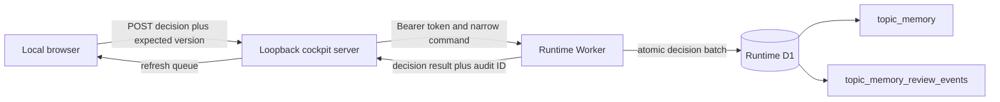

# Topic Memory Live Review Decisions — Coding-Agent Handoff

**Status:** Final architect approval — staging-validated controlled-write implementation approved 2026-08-12

## Final Approval Record

The post-`0003` implementation conforms to this handoff and is approved for source-control packaging and controlled production-promotion planning.

- Independent third-party review verdict: **PASS** after reassessing the guarded implementation and renewed staging evidence.
- Local verification passed: runtime 35 tests, local cockpit server 66 tests, ExCo cockpit 135 tests, and all package typechecks.
- Real Miniflare D1 integration proved successful approval, rejection, idempotency replay, and invariant-failure rollback of audit, candidate, and target effects.
- Staging backup/export completed before migration `0003`; the guard migration and Worker deployment version `b031483a-91a5-42f3-89ad-9f278210eaa9` were applied.
- Staging `REVIEW_DECISION_TOKEN` was verified as configured without exposing its value.
- Staging smoke tests verified approval aggregation, rejection preservation, identical-request replay, and `409` conflict with no audit, candidate, or target mutation.

This approval does **not** itself authorise production migration or deployment. Production promotion still requires a separate approved backup/export, secret verification, migration and deployment execution, and post-deployment smoke evidence under the operational gates in this handoff.

**Scope:** Localhost cockpit can submit narrowly authorised human review decisions to the deployed Cloudflare runtime, which applies an atomic D1 state transition and records an immutable runtime audit event.
## 1. Objective

Evolve the approved read-only composed review queue into a controlled live-review workflow for the sole currently approved candidate source: `topic_memory` rows whose `match_status` is `pending_review`.

A reviewer must be able to submit one of two decisions from the localhost dashboard:

| Human decision | Runtime outcome |
|---|---|
| **Approve match** | Merge the candidate into its proposed target’s trajectory, preserve both rows, and mark the candidate as merged into that target. |
| **Reject match** | Confirm the candidate as an independent memory, remove its proposed-match relationship, and leave the target unchanged. |

Every applied decision must use an exact source-version precondition and create one append-only, authoritative audit event in runtime D1. This is a separate workstream from the already approved read-only queue in [`composed-review-queue-poc-handoff-2026-08-12.md`](composed-review-queue-poc-handoff-2026-08-12.md).

## 2. Decisions already approved

1. The only candidate source in scope is `topic_memory.match_status = 'pending_review'`; do not add generic write support or new candidate types.
2. A candidate is a possible duplicate based on the existing deterministic entity and keyword-overlap heuristic in [`topic-memory.ts`](../packages/cloudflare-runtime/src/topic-memory.ts:73). It is **not** an extraction-confidence state.
3. Approval preserves the proposed target’s `canonical_statement`.
4. Approval aggregates the candidate’s trajectory into the target.
5. Approval retains the candidate as an individual source row linked to the target, creating a traceable path of change.
6. Rejection retains the candidate as a distinct confirmed memory and does not change the target.
7. An exact optimistic source-version check and immutable runtime audit are mandatory for every decision.
8. The localhost server remains loopback-only. Browser code must never receive a Cloudflare credential or access runtime D1 directly.
9. No R2 access, raw transcript exposure, storage locators, generic SQL execution, or arbitrary runtime-record mutation is in scope.

## 3. Current-state facts the implementation must preserve

- The processing flow creates a separate `topic_memory` row for every processed topic; it does not update an existing memory automatically. See [`matchTopicsToMemory()`](../packages/cloudflare-runtime/src/topic-memory.ts:73).
- The existing runtime endpoint accepts `reject` but has no concurrency control, no audit, and returns `501` for `accept`. Replace its behaviour rather than layering a second incompatible decision mechanism on top of it. See [`handlePatchTopicMemoryMatch()`](../packages/cloudflare-runtime/src/index.ts:267).
- Runtime deployment migrations are sourced only from [`packages/cloudflare-runtime/migrations`](../packages/cloudflare-runtime/migrations). [`wrangler.jsonc`](../packages/cloudflare-runtime/wrangler.jsonc:16) declares that migration directory for both production and staging. Do **not** modify the legacy canonical migrations under [`packages/d1/migrations`](../packages/d1/migrations).
- The local cockpit currently reads runtime D1 through a read-only management API adapter and writes generic annotations to a separate feedback D1. See [`runtime-d1.ts`](../packages/local-cockpit-server/src/adapters/runtime-d1.ts:34) and [`feedback-d1.ts`](../packages/local-cockpit-server/src/adapters/feedback-d1.ts:62).

## 4. Required architecture



### 4.1 Authority boundaries

- **Runtime Worker plus runtime D1** is the only authority that applies a review decision.
- **Runtime D1 audit** is the authoritative immutable record for a decision and its rationale. Do not rely on a feedback-D1 row as proof that a runtime state transition occurred.
- The existing feedback D1 remains an append-only store for non-decision quality feedback through the existing feedback API. It must not be used as a second write in the approval/rejection path.
- Decision feedback required by this workflow is stored in the runtime audit event within the same D1 batch as the state changes. This avoids a split-brain outcome where runtime changes but feedback persistence fails, or vice versa.

### 4.2 Narrow runtime API

Retain `PATCH /v1/topic-memory/:id/match` as the only runtime mutation route in scope, but replace its request and response contract completely.

**Authentication**

- Add a dedicated Worker secret named `REVIEW_DECISION_TOKEN` and add it to [`Env`](../packages/cloudflare-runtime/src/types.ts:8).
- This token authorises only this narrow runtime endpoint in code. It must be distinct from `SUBMISSION_TOKEN`, which remains reserved for meeting submission.
- The local server stores the token in git-ignored [`packages/local-cockpit-server/.env.local`](../packages/local-cockpit-server/.env.local) via new validated variables `RUNTIME_REVIEW_API_URL` and `RUNTIME_REVIEW_DECISION_TOKEN`.
- The browser must call only the local route defined below. It must never receive either value.
- Use `Authorization: Bearer <REVIEW_DECISION_TOKEN>` and reject all missing or incorrect credentials with `401`.

**Request body**

```ts
interface TopicMemoryReviewDecisionRequest {
  decision: 'approve_match' | 'reject_match';
  expectedSourceVersion: string;
  expectedProposedMatchMemoryId: string;
  reviewerName: string;
  note: string;
  warningAcknowledged: true;
  idempotencyKey: string;
}
```

Validation requirements:

- Reject unknown keys only if that is consistent with current runtime API policy; all listed fields are mandatory.
- Validate non-empty, bounded-length, trimmed text for version, target ID, reviewer name, note, and idempotency key.
- `warningAcknowledged` must be exactly `true`.
- Validate IDs against the project’s existing safe identifier grammar before binding them.
- Require `expectedProposedMatchMemoryId` even for rejection. It proves the reviewer assessed the exact candidate/target relationship shown in the queue.
- Do not accept a target ID selected freely by the browser.

**Success response**

```ts
interface TopicMemoryReviewDecisionResponse {
  decision: 'approve_match' | 'reject_match';
  candidateMemoryId: string;
  candidateMatchStatus: 'merged' | 'confirmed';
  targetMemoryId: string;
  candidateUpdatedAt: string;
  targetUpdatedAt: string | null;
  auditEventId: string;
  appliedAt: string;
  idempotentReplay: boolean;
}
```

For `reject_match`, `targetMemoryId` is the reviewed proposed target and `targetUpdatedAt` is `null`, since the target is unchanged.

**Failure contract**

| Status | Meaning |
|---|---|
| `400` | Invalid body or prohibited value. |
| `401` | Missing or invalid decision token. |
| `404` | Candidate does not exist. |
| `409` | Candidate is no longer pending, source version differs, proposed target differs, target is missing/ineligible, or idempotency key was reused with different content. No audit event or mutation may be written. |
| `500` | Unexpected infrastructure failure. Do not expose secrets or raw SQL in the error. |

A repeated request with the same `idempotencyKey` and semantically identical payload must return the original successful response with `idempotentReplay: true`; it must not write a second audit event or alter trajectory again.

## 5. Runtime D1 migration specification

Create exactly one new, forward-only migration:

- [`0002_topic_memory_live_review_decisions.sql`](../packages/cloudflare-runtime/migrations/0002_topic_memory_live_review_decisions.sql)

Use the Worker migration directory only. It must apply successfully to staging before production. Do not edit migration `0001` and do not renumber existing migrations.

### 5.1 `topic_memory` schema changes

Add the following columns:

```sql
ALTER TABLE topic_memory
  ADD COLUMN merged_into_memory_id TEXT REFERENCES topic_memory(memory_id);

ALTER TABLE topic_memory
  ADD COLUMN review_resolved_at TEXT;

ALTER TABLE topic_memory
  ADD COLUMN review_event_id TEXT;
```

Add indexes:

```sql
CREATE INDEX IF NOT EXISTS idx_topic_memory_merged_into
  ON topic_memory(merged_into_memory_id);

CREATE INDEX IF NOT EXISTS idx_topic_memory_review_resolution
  ON topic_memory(match_status, review_resolved_at);
```

Use these controlled values for `match_status` after migration:

- `confirmed`: independent confirmed memory.
- `pending_review`: only state eligible for a decision.
- `merged`: retained source memory merged into `merged_into_memory_id`.

Do not use the existing undocumented `rejected` value for this workflow. A rejected **match** is not a rejected memory; it is a confirmed distinct memory.

### 5.2 Authoritative immutable audit table

Create this table:

```sql
CREATE TABLE IF NOT EXISTS topic_memory_review_events (
  review_event_id                  TEXT PRIMARY KEY,
  candidate_memory_id              TEXT NOT NULL REFERENCES topic_memory(memory_id),
  target_memory_id                 TEXT NOT NULL REFERENCES topic_memory(memory_id),
  decision                         TEXT NOT NULL CHECK (decision IN ('approve_match', 'reject_match')),
  expected_source_version          TEXT NOT NULL,
  observed_source_version          TEXT NOT NULL,
  expected_proposed_match_memory_id TEXT NOT NULL,
  observed_proposed_match_memory_id TEXT NOT NULL,
  reviewer_name                    TEXT NOT NULL,
  reviewer_note                    TEXT NOT NULL,
  warning_acknowledged             INTEGER NOT NULL CHECK (warning_acknowledged = 1),
  idempotency_key                  TEXT NOT NULL UNIQUE,
  candidate_match_status_before    TEXT NOT NULL,
  candidate_match_status_after     TEXT NOT NULL,
  target_meeting_count_before      INTEGER,
  target_meeting_count_after       INTEGER,
  created_at                       TEXT NOT NULL DEFAULT (datetime('now'))
);

CREATE INDEX IF NOT EXISTS idx_topic_memory_review_events_candidate_created
  ON topic_memory_review_events(candidate_memory_id, created_at DESC);

CREATE INDEX IF NOT EXISTS idx_topic_memory_review_events_target_created
  ON topic_memory_review_events(target_memory_id, created_at DESC);
```

Audit immutability requirements:

- Application code must contain no `UPDATE` or `DELETE` statement targeting `topic_memory_review_events`.
- The Worker must only issue an insert for this table as part of a successful decision batch.
- The local server must have no runtime D1 management write token and no generic write adapter.
- Document that privileged D1 administrators can still alter data; this is application-level append-only immutability, not cryptographic or administrator-proof immutability.

## 6. Atomic state-transition requirements

Use a single D1 `batch` for every successful decision. The coding agent must design statements so an unsuccessful compare-and-set condition causes the whole batch to fail or be rolled back. Do not write audit first and then attempt updates without proving both affected rows remain valid.

Before the batch, read the candidate and target using only their IDs. Treat the read as advisory; enforce all preconditions again inside the mutation statements.

### 6.1 Preconditions for both decisions

Candidate must:

- exist;
- have `match_status = 'pending_review'`;
- have `updated_at = expectedSourceVersion` exactly;
- have `proposed_match_memory_id = expectedProposedMatchMemoryId` exactly;
- not already have `merged_into_memory_id`.

Target must:

- exist;
- equal the candidate’s currently proposed target;
- not equal the candidate;
- be eligible as an independent trajectory root: `match_status != 'merged'` and `merged_into_memory_id IS NULL`.

If any condition changes between render and commit, return `409`, write no audit event, and do not mutate either memory.

### 6.2 Approve-match transaction

Within the successful batch:

1. Insert one audit row recording before-state values and the submitted reviewer data.
2. Update the candidate only if every candidate precondition still holds:
   - set `match_status = 'merged'`;
   - set `merged_into_memory_id = expectedProposedMatchMemoryId`;
   - set `review_resolved_at = datetime('now')`;
   - set `review_event_id = review_event_id`;
   - retain `canonical_statement`, both first/last source fields, `meeting_count`, and the original `proposed_match_*` fields as historical provenance;
   - set `updated_at = datetime('now')`.
3. Update the target only while it is still eligible:
   - retain its `canonical_statement` unchanged;
   - set `first_seen_date` to the earliest non-null of target/candidate dates;
   - set `first_seen_meeting_id` to the meeting ID associated with that selected earliest date; if dates tie, preserve the target’s existing first-seen ID;
   - set `last_seen_date` to the latest non-null of target/candidate dates;
   - set `last_seen_meeting_id`, `latest_outcome`, `latest_disposition`, and `latest_executive_scope` from the row with that selected latest date; if dates tie, preserve the target’s existing latest values;
   - set `meeting_count = target.meeting_count + candidate.meeting_count` exactly once;
   - leave target `match_status` and `status` unchanged;
   - set `updated_at = datetime('now')`.
4. Ensure the audit row stores both target meeting-count values so a reviewer can reconstruct the effect.

No topic rows, meeting rows, R2 objects, or candidate/target canonical text may be deleted or overwritten by this operation.

### 6.3 Reject-match transaction

Within the successful batch:

1. Insert one audit row recording before-state values and reviewer data.
2. Update the candidate only if every candidate precondition still holds:
   - set `match_status = 'confirmed'`;
   - set `merged_into_memory_id = NULL`;
   - set `review_resolved_at = datetime('now')`;
   - set `review_event_id = review_event_id`;
   - set `proposed_match_memory_id = NULL` and `proposed_match_reason = NULL` because the proposal has been resolved as not-a-match;
   - preserve every trajectory and content field;
   - set `updated_at = datetime('now')`.
3. Do not update the target; audit count-before and count-after are both its current count.

## 7. Local cockpit changes

### 7.1 New runtime command client

Create a dedicated local-server client such as [`runtime-review-client.ts`](../packages/local-cockpit-server/src/adapters/runtime-review-client.ts) rather than adding write capability to [`runtime-d1.ts`](../packages/local-cockpit-server/src/adapters/runtime-d1.ts:34).

It must:

- have one typed `submitTopicMemoryDecision` method;
- call only `PATCH <RUNTIME_REVIEW_API_URL>/v1/topic-memory/:id/match`;
- apply the bearer decision token server-side;
- set JSON content type;
- use a bounded timeout and safe error mapping;
- return typed success/conflict/error results;
- never log the token or full reviewer note.

### 7.2 New local API route

Add:

```text
POST /api/v1/review-queue/memory/:memoryId/decision
```

The local route must:

- accept the same decision payload described in section 4.2;
- validate the path and all body fields before forwarding;
- generate an idempotency key server-side if the browser does not send one, and return it in the result;
- forward exactly the approved command to the runtime Worker;
- map runtime `409` through unchanged in meaning and return current refresh guidance;
- never proxy arbitrary runtime paths, methods, headers, or bodies;
- return only decision outcome fields; do not expose Worker credentials, R2 keys, transcript text, or raw D1 errors.

Update [`ApiDeps`](../packages/local-cockpit-server/src/api/index.ts:14), [`server.ts`](../packages/local-cockpit-server/src/server.ts:19), [`env.ts`](../packages/local-cockpit-server/src/env.ts:7), [`.env.local.example`](../packages/local-cockpit-server/.env.local.example), and [`RUNBOOK.md`](../packages/local-cockpit-server/RUNBOOK.md) accordingly.

### 7.3 Queue and audit presentation

- After a successful decision, refresh `GET /api/v1/review-queue` from runtime D1; do not move a card locally without server confirmation.
- A successful approve/reject removes the candidate from Awaiting review because it no longer has `pending_review` status.
- Add a runtime decision-history view sourced from `topic_memory_review_events`, through an explicit fixed read adapter method and local endpoint. It must label decisions as **Runtime decision applied**, include reviewer, decision, note, timestamp, candidate, target, and audit event ID.
- Preserve the existing feedback panel as **Feedback recorded only**. Do not let an ordinary feedback verdict imply a live runtime decision.
- Existing feedback-only Recorded decisions may remain as historical annotations, but they must be visually distinguished from runtime decisions and cannot hide or resolve a current pending candidate.

### 7.4 Dashboard interaction requirements

Update [`app.js`](../packages/exco-cockpit/public/app.js:597) and associated HTML/CSS only as needed to provide:

- distinct **Approve match and merge** and **Reject match and keep separate** actions for an awaiting candidate;
- an explicit confirmation state explaining the exact outcome for each action;
- mandatory reviewer name, non-empty decision note, and existing retention-warning acknowledgement;
- disabled duplicate submission while a request is in flight;
- source version and expected target sent from the current queue item;
- success message with decision and audit event ID;
- `409` handling that discards stale local action state, refreshes the queue, and tells the reviewer to reassess current data;
- accessible live status/error feedback and keyboard-operable controls;
- no browser-side secret, direct Cloudflare call, R2 locator, or transcript field.

## 8. Deployment and operational gates

1. Deploy and validate migration plus Worker logic in staging first, using the `staging` D1 binding in [`wrangler.jsonc`](../packages/cloudflare-runtime/wrangler.jsonc:47).
2. Before production migration, obtain and record a recoverable runtime-D1 backup/export reference.
3. Provision `REVIEW_DECISION_TOKEN` as a Worker secret; do not put it in [`wrangler.jsonc`](../packages/cloudflare-runtime/wrangler.jsonc:1), source code, test fixtures, or browser assets.
4. Provision the equivalent local environment variable only on an authorised operator workstation; it must be git-ignored.
5. Update the operator runbook so the preflight/postflight comparison allows only expected review-event and reviewed-memory changes. Unexpected row changes remain an incident.
6. Preserve loopback-host checks and forbid tunnel, port forwarding, remote deployment of the local server, and direct runtime D1 management write credentials.
7. Rollback plan: Worker rollback alone is insufficient once a decision is recorded. Do not delete audit events or restore individual rows ad hoc. Use the audited state and an explicitly approved compensating workflow if reversals are later required.

## 9. Required tests and evidence

### Runtime Worker tests

Extend [`index.test.ts`](../packages/cloudflare-runtime/src/index.test.ts:443) and add focused tests as needed. Prove:

- missing/wrong decision token returns `401`;
- malformed request and missing mandatory values return `400`;
- approved merge preserves candidate content and canonical target statement;
- approved merge marks candidate `merged`, links it to the target, updates target trajectory exactly once, and writes one audit row;
- rejected match marks candidate `confirmed`, clears proposal, leaves target unchanged, and writes one audit row;
- candidate absent returns `404`;
- stale candidate version, already-resolved candidate, changed proposed target, missing target, merged target, and self-target all return `409` with no partial write and no audit row;
- same idempotency key and payload replays the original result without a second event or count increase;
- same idempotency key with different payload returns `409` without mutation;
- no route exposes generic SQL or arbitrary record updates.

### Migration verification

- Apply the migration to an empty D1 and a representative pre-migration fixture.
- Verify additive schema changes, indexes, and table creation.
- Verify existing `confirmed` and `pending_review` rows remain readable.
- Verify the deployed migration source is only [`packages/cloudflare-runtime/migrations`](../packages/cloudflare-runtime/migrations).

### Local server tests

- Route validation blocks malformed ID/body and does not call the runtime client.
- Local route forwards only the narrow command and does not expose token in response/log fixture.
- Runtime `409` reaches browser-compatible API response without being converted to success.
- Timeout and runtime `5xx` return safe failures and do not fabricate local success.
- Review-event history endpoint is fixed-query/read-only and omits prohibited fields.

### Browser tests

Extend [`browser.test.ts`](../packages/exco-cockpit/src/browser.test.ts:835) to prove:

- actions require reviewer name, note, acknowledgement, and explicit confirmation;
- approve sends expected source version and expected proposed target;
- reject sends the same concurrency context;
- success refreshes the queue and reports audit ID;
- controls disable during submission and recover safely after failure;
- `409` refreshes/reopens the actual current candidate rather than displaying a false success;
- runtime decision history is distinguished from feedback-only annotations;
- no fetch request targets Cloudflare directly and no rendered content reveals credentials, transcript, or storage-locator data.

### Required implementation report

The third-party implementer must provide:

- exact changed-file list;
- migration application evidence for staging;
- test commands and full passing results;
- an explicit explanation of batch atomicity and conflict detection;
- confirmation that no runtime D1 management write token was added to the local server;
- evidence that the decision token is a Worker secret and absent from version control;
- `git diff --check` result;
- known limitations and any deviations from this handoff.

## 10. Non-goals

- No automated merge after heuristic matching.
- No merge reversal UI in this workstream.
- No canonical statement rewrite during approval.
- No generic D1 admin/editor feature.
- No new review candidate types.
- No changes to topic/meeting source data or R2 objects.
- No remote/production deployment of the local cockpit server.
- No claim of administrator-proof database immutability.

## 11. Independent-review checklist

A separate reviewer must verify, independently of the implementer:

1. Only pending `topic_memory` candidates are mutable through the route.
2. Approval and rejection satisfy the exact semantics in section 6.
3. All candidate/target preconditions are enforced at commit time, not only in a pre-read.
4. Batch failure cannot leave candidate, target, and audit inconsistent.
5. Idempotency prevents duplicate trajectory aggregation.
6. Audit rows are append-only in application code and contain sufficient reviewer/provenance context.
7. Browser code has no credential or direct Cloudflare path.
8. The local server has a narrow Worker command client, not a generic runtime D1 write adapter.
9. Existing feedback annotations are clearly separated from authoritative runtime decisions.
10. Staging-first migration, backup, runbook, tests, and all acceptance evidence are complete.
